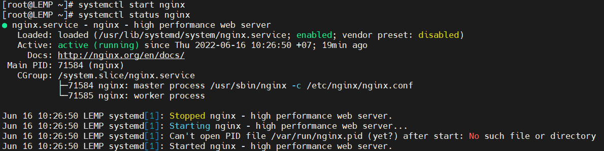

# Menu
[I. Cấu hình NGINX và cấu hình cơ bản](#cau_hinh_nginx)
- [1. Tắt selinux](#tat_selinux)
- [2. Cấu hình nginx cơ bản](#cau_hinh_nginx_co_ban)
- [3. KhởI động nginx](#khoi_dong_nginx)
  
[II. Cài đặt MariaDB](#cai_dat_mariaDB)
- [1. Tạo repo cài đặt MariaDB](#tao_repo_cai_dat_mariadb)
- [2. Cài đặt MariaDB](#cai_dat_mariadb)
- [3. Đặt mật khẩu root](#dat_mat_khau_root)

[III. Cài đặt PHP](#cai_dat_php)


<a name="cau_hinh_nginx"></a>

## I. Cấu hình NGINX và cấu hình cơ bản.

<a name="tat_selinux"></a>

### 1. Tắt selinux
Sử dụng lệnh sau để tắt Selinux: `sed -i 's/SELINUX=enforcing/SELINUX=disabled/g' /etc/selinux/config && setenforce 0`

Để cài đặt phiên bản mới nhất của Nginx chúng ta cần tạo repo riêng bằng cách tạo file `vi /etc/yum.repos.d/nginx.repo` với nội dung sau:
```
[nginx-stable]
name=nginx stable repo
baseurl=http://nginx.org/packages/centos/$releasever/$basearch/
gpgcheck=1
enabled=1
gpgkey=https://nginx.org/keys/nginx_signing.key
module_hotfixes=true
```

Sau khi tạo repo các bạn chạy lệnh sau để cài đặt Nginx: `yum install -y epel-release nginx`

Để kiểm tra phiên bản Nginx được cài đặt các bạn có thể dùng lệnh sau: `nginx -v`
```
[root@LEMP ~]# nginx -v
nginx version: nginx/1.22.0
[root@LEMP ~]#
```

Nếu sử dụng Firewalld thì bạn sẽ cần mở port để có thể truy cập website
```
firewall-cmd --add-service=http --permanent
firewall-cmd --add-service=https --permanent
firewall-cmd --reload
```

<a name="cau_hinh_nginx_co_ban"></a>

### 2. Cấu hình nginx cơ bản.
Trước khi bắt đầu cấu hình Nginx các bạn nên backup lại file config để có thể khôi phục khi cần thiết: `cp /etc/nginx/nginx.conf /etc/nginx/nginx.conf.bak`

Sau khi đã backup file cấu hình các bạn mở file `/etc/nginx/nginx.conf` và xoá sạch nội dung bên trong và thay thế bằng nội dung sau đây:
```
user  nginx;
 
worker_processes  auto;
pid /var/run/nginx.pid;
 
#error_log  logs/error.log;
#error_log  logs/error.log  notice;
#error_log  logs/error.log  info;
 
events {
   worker_connections  10240;
}
 
 
http {
   include       /etc/nginx/mime.types;
 
   default_type  application/octet-stream;
   tcp_nopush on;
   tcp_nodelay on;
   sendfile        on;
 
   log_format bytes '$bytes_sent $request_length';
 
   keepalive_timeout  15;
   types_hash_max_size 2048;
 
   disable_symlinks if_not_owner from=$document_root;
 
   server_tokens off;
 
   add_header X-Frame-Options SAMEORIGIN;
   add_header X-XSS-Protection "1; mode=block";
   add_header X-Content-Type-Options nosniff;
   add_header Strict-Transport-Security "max-age=63072000; includeSubdomains";
   
   client_max_body_size 1024m;
   client_body_buffer_size 128k;
 
   server_names_hash_bucket_size 128;
   server_names_hash_max_size 10240;
 
   ssl_dhparam /etc/nginx/ssl/dhparams.pem;
   ssl_session_cache   shared:SSL:10m;
   ssl_session_timeout  5m;
   proxy_read_timeout 1800s;
 
   ssl_protocols TLSv1.2 TLSv1.3;
   ssl_ciphers ECDHE-ECDSA-AES128-GCM-SHA256:ECDHE-RSA-AES128-GCM-SHA256:ECDHE-ECDSA-AES256-GCM-SHA384:ECDHE-RSA-AES256-GCM-SHA384:ECDHE-ECDSA-CHACHA20-POLY1305:ECDHE-RSA-CHACHA20-POLY1305:DHE-RSA-AES128-GCM-SHA256:DHE-RSA-AES256-GCM-SHA384;
   ssl_prefer_server_ciphers on;
 
   index  index.html index.htm index.php;
 
   gzip on;
   gzip_static on;
   gzip_disable "msie6";
   gzip_http_version 1.1;
   gzip_vary on;
   gzip_comp_level 1;
   gzip_proxied any;
   gzip_types text/plain text/css application/json application/x-javascript text/xml application/xml application/xml+rss text/javascript application/javascript text/x-js image/svg+xml;
   gzip_buffers 16 8k;
 
   include /etc/nginx/conf.d/*.conf;
}
```

- Tạo dhparam
Để tạo dhparam các bạn chạy 2 lệnh sau
```
mkdir -p /etc/nginx/ssl
openssl dhparam -out /etc/nginx/ssl/dhparams.pem 2048
```

<a name="khoi_dong_nginx"></a>

### 3. Khởi động nginx.
- Kiểm tra cấu hình
Trước khi khởi động Nginx các bạn có thể kiểm tra xem cấu hình có bị lỗi gì không bằng cách chạy lệnh sau: `nginx -t`
```
[root@LEMP ~]# nginx -t
nginx: the configuration file /etc/nginx/nginx.conf syntax is ok
nginx: configuration file /etc/nginx/nginx.conf test is successful
[root@LEMP ~]#
```

- Khởi động nginx
```
systemctl enable nginx
systemctl start nginx
```


<a name="cai_dat_mariadb"></a>

## II. Cài đặt MariaDB

<a name="tao_repo_cai_dat_mariadb"></a>

### 1. Tạo repo cài đặt MariaDB 
Các bạn tạo file `/etc/yum.repos.d/mariadb.repo` với nội dung sau:
```
[mariadb]
name = MariaDB
baseurl = http://yum.mariadb.org/10.7.1/rhel7-amd64/
gpgkey=https://yum.mariadb.org/RPM-GPG-KEY-MariaDB
gpgcheck=1
```

<a name="cai_dat_mariadb"></a>

### 2. Cài đặt MariaDB
Để cài đặt MariaDB, ta chạy lệnh sau: `yum install MariaDB-server MariaDB-client -y`

<a name="dat_mat_khau_root"></a>

### 3. Đặt mật khẩu root
Sau khi cài MariaDB, chạy 2 lệnh sau để khởi động MariaDB:
```
systemctl enable mariadb
systemctl start mariadb
```

Tiếp theo, tiến hành cấu hình MariaDB: `mysql_secure_installation`
```
Enter current password for root (enter for none): Nhấn phím Enter
Switch to unix_socket authentication [Y/n]: n
Change the root password? [Y/n]: Y
New password: Nhập password root các bạn muốn tạo
Re-enter new password: Nhập lại password root
Remove anonymous users? [Y/n] : Y
Disallow root login remotely? [Y/n]: Y
Remove test database and access to it? [Y/n] : Y
Reload privilege tables now? [Y/n]: Y
```

Truy cập MariaDB tạo Database: `mysql -u root -p`

- Sử dụng cú pháp MySQL để tạo Database: `CREATE DATABASE LEMP;`
- Tạo bảng: `CREATE TABLE LEMP.LEMP (id INT PRIMARY KEY, name VARCHAR(30));`
- Thêm dữ liệu vào bảng vừa tạo: `INSERT INTO LEMP.LEMP VALUES (1, 'name1');`
- tạo user à `user` với mật khẩu là `password`: `CREATE USER 'user'@'localhost' IDENTIFIED BY 'password';`
- Tại thời điểm này, `user` không có quyền làm bất cứ điều gì với cơ sở dữ liệu. Dó đó, ta sẽ cấp quyền truy cập trên database LEMP cho user: `GRANT ALL ON LEMP.* TO 'user'@'localhost';`
- Reload privileges: `FLUSH PRIVILEGES;`
- Sau khi hoàn tất, ta thoát MariaDB: `exit`

<a name="cai_dat_php"></a>

## III. Cài đặt PHP
Tạo kho lưu trữ remi bằng lệnh: `yum install http://rpms.remirepo.net/enterprise/remi-release-7.rpm -y`

Tiếp theo, hãy chọn phiên bản PHP cần cài đặt và kích hoạt gói remi tương ứng với phiên bản đó. Trong bài viết này, chúng ta sẽ cài đặt PHP 8.0: `yum install install yum-utils -y && sudo yum-config-manager --enable remi-php80`

**Lưu ý: số 80 tương ứng với PHP 8.0, bạn có thể thay thế bằng phiên bản PHP bạn muốn (Ví dụ: 72 – 73 –74 tương ứng 7.2 –7.3 – 7.4..)**

Bây giờ, có thể sử dụng lệnh yum để cài đặt `php 8.0`, bao gồm cả các gói kèm theo (php-fpm, php-mysql): `yum install php php-mysql php-fpm -y`

Kiểm tra lại phiên bản PHP vừa cài đặt bằng lệnh: `php -v`


# Tài liệu tham khảo
[1. Tenten](https://tenten.vn/help/huong-dan-cach-cai-dat-lemp-tren-centos-7/)

[2. 123.host.vn](https://123host.vn/community/tutorial/huong-dan-cai-dat-va-cau-hinh-lemp-stack-tren-centos-7.html)


