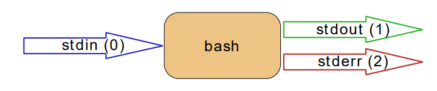
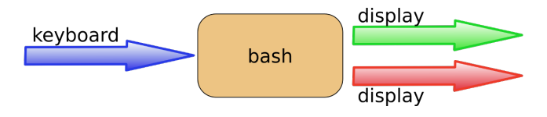
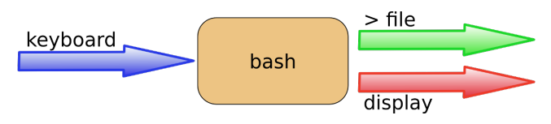

# Menu
[I. stdin, stdout và stderr](#stdin-stdout-stderr)

[II. Chuyển hướng đầu ra](#chuyen_huong_dau_ra)
- [1. > stdout](#>_stdout)
- [2. Tập tin đầu ra bị xóa](#tap_tin_dau_ra_bi_xoa)
- [3. noclobber](#noclobber)
- [4. overruling noclobber](#overruling_noclobber)
- [5. >> nối thêm](#>>_noi_them)

[III. Chuyển hướng lỗi](#chuyen_huong_loi)
- [1. 2> stderr](#2>_stderr)
- [2. 2>&1](#2>&1)

[IV. Chuyển hướng đầu ra và đường ống](#chuyen_huong_dau_ra_va_duong_ong)

[V. Tham gia stdout và stderr](#tham_gia_stdout_va_stderr)

[VI. Chuyển hướng đầu vào](#chuyen_huong_dau_vao)
- [1. < stdin (chưa hiểu)](#<_stdin)
- [2. << here document](#<<)
- [3. <<< here string](#<<<)

[VII. Chuyển hướng khó hiểu](#chuyen_huong_kho_hieu)


Một trong những sức mạnh của dòng lệnh Unix là sử dụng chuyển hướng đầu vào / đầu ra và đường ống.
Chương này giải thích chuyển hướng các luồng đầu vào, đầu ra và lỗi.

<a name="stdin-stdout-stderr"></a>

## I. stdin, stdout và stderr
Bash shell có ba luồng cơ bản; nó nhận đầu vào từ `stdin` (luồng 0), nó gửi đầu ra tới `stdout` (luồng 1) và nó gửi thông báo lỗi đến `stderr` (luồng 2).
Ví dụ bên dưới giải thích bằng đồ họa của ba luồng này.


Bàn phím thường đóng vai trò là `stdin`, trong khi `stdout` và `stderr` đều đi đến màn hình. Đây có thể gây nhầm lẫn cho người dùng Linux mới vì không có cách rõ ràng nào để nhận ra stdout từ `stderr`. Người dùng có kinh nghiệm biết rằng việc tách đầu ra khỏi lỗi có thể rất hữu ích.


Các phần tiếp theo sẽ giải thích cách chuyển hướng các luồng này

<a name="chuyen_huong_dau_ra"></a>

## II. Chuyển hướng đầu ra

<a name=">_stdout"></a>

### 1. > stdout
`stdout` có thể được chuyển hướng bằng dấu lớn hơn. Trong khi quét dòng, shell sẽ xem dấu `>` và sẽ xóa tệp.

Ký hiệu `>` thực chất là chữ viết tắt của `1>` (stdout được gọi là luồng 1).
```
[root@laiduy ~]# echo ten toi la Lai Khanh Duy
ten toi la Lai Khanh Duy
[root@laiduy ~]# echo ten toi la Lai Khanh Duy > thu.txt
[root@laiduy ~]# cat thu.txt
ten toi la Lai Khanh Duy
[root@laiduy ~]#
```

<a name="tap_tin_dau_ra_bi_xoa"></a>

### 2. Tập tin đầu ra bị xóa
Trong khi quét dòng, shell sẽ thấy dấu `>` và sẽ xóa tệp. Kể từ đây xảy ra trước khi giải quyết đối số 0, điều này có nghĩa là ngay cả khi lệnh không thành công, tập tin sẽ được xóa.
```
[root@laiduy ~]# cat thu.txt
ten toi la Lai Khanh Duy
[root@laiduy ~]# echoo Nam nay 20t > thu.txt
-bash: echoo: command not found
[root@laiduy ~]# cat thu.txt
[root@laiduy ~]#
```

<a name="noclobber"></a>

### 3. noclobber
Có thể ngăn việc xóa tệp khi đang sử dụng `>` bằng cách đặt tùy chọn `noclobber`.
```
[root@laiduy ~]# cat thu.txt
ten toi la Lai Khanh Duy
[root@laiduy ~]# set -o noclobber
[root@laiduy ~]# echo ten toi la Lai Khanh Duy > thu.txt
-bash: thu.txt: cannot overwrite existing file
[root@laiduy ~]# set +o noclobber
[root@laiduy ~]#
```

**Lệnh `set +o noclobber` để tắt noclobber**

<a name="overruling_noclobber"></a>

### 4. overruling noclobber
`Noclobber` có thể được thay thế bằng `>|`.
```
[root@laiduy ~]# set -o noclobber
[root@laiduy ~]# echo ten toi la Lai Khanh Duy > thu.txt
-bash: thu.txt: cannot overwrite existing file
[root@laiduy ~]# echo ten toi la Lai Khanh Duy >| thu.txt
[root@laiduy ~]# cat thu.txt
ten toi la Lai Khanh Duy
[root@laiduy ~]#
```

<a name=">>_noi_them"></a>

### 5. >> nối thêm
Sử dụng `>>` để nối đầu ra vào một tệp.
```
[root@laiduy ~]# echo ten toi la Lai Khanh Duy > thu.txt
[root@laiduy ~]# cat thu.txt
ten toi la Lai Khanh Duy
[root@laiduy ~]# echo nha o Tuyen Quang >> thu.txt
[root@laiduy ~]# cat thu.txt
ten toi la Lai Khanh Duy
nha o Tuyen Quang
[root@laiduy ~]#
```

<a name="chuyen_huong_loi"></a>

## III. Chuyển hướng lỗi

<a name="2>_stderr"></a>

### 1. 2> stderr
Chuyển hướng stderr được thực hiện với `2>`. Điều này có thể rất hữu ích để ngăn các thông báo lỗi từ làm lộn xộn màn hình của bạn.

Ví dụ bên dưới cho thấy chuyển hướng của `stdout` đến một tệp và `stderr` thành `/dev/null`. Viết `1>` giống với `>`.
```
[root@laiduy ~]#  find / > allfiles.txt 2> /dev/null
[root@laiduy ~]#
```

<a name="2>&1"></a>

### 2. 2>&1
Để chuyển hướng cả `stdout` và `stderr` đến cùng một tệp, hãy sử dụng `2>&1`.
Lưu ý rằng thứ tự chuyển hướng có ý nghĩa quan trọng. Ví dụ, lệnh: `ls > dirlist 2>&1` chuyển hướng cả đầu ra chuẩn (bộ mô tả tệp 1) và lỗi chuẩn (bộ mô tả tệp 2) đến danh sách tệp, trong khi lệnh `ls 2>&1 > dirlist` chỉ hướng đầu ra tiêu chuẩn vào danh sách tệp, vì lỗi tiêu chuẩn đã tạo ra một bản sao của đầu ra tiêu chuẩn trước khi đầu ra tiêu chuẩn được chuyển hướng đến danh sách `dirlist`.

<a name="chuyen_huong_dau_ra_va_duong_ong"></a>

## IV. Chuyển hướng đầu ra và đường ống
Theo mặc định, bạn không thể `grep` bên trong `stderr` khi sử dụng các đường dẫn trên dòng lệnh, bởi vì chỉ có stdout được thông qua.
```
[root@laiduy ~]# rm file42 file33 file1201 | grep file42
rm: cannot remove ‘file42’: No such file or directory 
rm: cannot remove ‘file1201’: No such file or directory
[root@laiduy ~]#
```

Với `2>&1`, bạn có thể buộc stderr chuyển đến stdout. Điều này cho phép lệnh tiếp theo trong ống để tác động lên cả hai luồng.
```
[root@laiduy ~]# rm file42 file33 file1201 2>&1 | grep file42
rm: cannot remove ‘file42’: No such file or directory
[root@laiduy ~]#
```
Bạn không thể sử dụng cả `1>&2` và `2>&1` để chuyển đổi `stdout` và `stderr`.
```
[root@laiduy ~]# rm file42 file33 file1201 2>&1 1>&2 | grep file42
rm: cannot remove ‘file42’: No such file or directory
[root@laiduy ~]# echo file42 2>&1 1>&2 | sed 's/file42/FILE42/'
FILE42
[root@laiduy ~]#
```
Bạn cần một luồng thứ ba để chuyển stdout và stderr sau một ký hiệu ống.
```
[root@laiduy ~]#  echo file42 3>&1 1>&2 2>&3 | sed 's/file42/FILE42/'
file42
[root@laiduy ~]# rm file42 3>&1 1>&2 2>&3 | sed 's/file42/FILE42/'
rm: cannot remove ‘FILE42’: No such file or directory
[root@laiduy ~]#
```
<a name="tham_gia_stdout_va_stderr"></a>

## V. Tham gia stdout và stderr
Cấu trúc `&>` sẽ đặt cả stdout và stderr vào một luồng (vào một tệp).
```
[root@laiduy ~]#  rm file42 &> out_and_err
[root@laiduy ~]# cat out_and_err
rm: cannot remove ‘file42’: No such file or directory
[root@laiduy ~]#  echo file42 &> out_and_err
[root@laiduy ~]# cat out_and_err
file42
[root@laiduy ~]#
```

<a name="chuyen_huong_dau_vao"></a>

## VI. Chuyển hướng đầu vào

<a name="<_stdin"></a>

### 1. < stdin (chưa hiểu)
Chuyển hướng `stdin` được thực hiện với <(viết tắt của 0 <).

<a name="<<"></a>

### 2. << here document
`here document` (đôi khi được gọi là here-is-document) là một cách để thêm đầu vào cho đến khi trình tự nhất định (thường là EOF) được gặp phải. Điểm đánh dấu `EOF` có thể được nhập theo nghĩa đen hoặc có thể được gọi bằng `Ctrl-D`.
```
[root@laiduy ~]# cat <<EOF > text.txt
> mot
> hai
> EOF
[root@laiduy ~]#  cat text.txt
mot
hai
[root@laiduy ~]#
```

<a name="<<<"></a>

### 3. <<< here string
Chuỗi ở đây có thể được sử dụng để chuyển trực tiếp các chuỗi tới một lệnh. Kết quả là như nhau như sử dụng `chuỗi echo | lệnh` (nhưng bạn có một quá trình ít hơn đang chạy).
```
[root@laiduy ~]#  base64 <<< linux-training.be
bGludXgtdHJhaW5pbmcuYmUK
[root@laiduy ~]#  base64 -d <<< bGludXgtdHJhaW5pbmcuYmUK
linux-training.be
[root@laiduy ~]#
```

<a name="chuyen_huong_kho_hieu"></a>

## VII. Chuyển hướng khó hiểu
Shell sẽ quét toàn bộ dòng trước khi áp dụng chuyển hướng. Dòng lệnh sau rất dễ đọc và chính xác: `cat winter.txt > snow.txt 2> errors.txt`.
Nhưng cái này cũng đúng, nhưng ít đọc hơn: `2> errors.txt cat winter.txt > snow.txt`.
Ngay cả điều này sẽ được hiểu một cách hoàn hảo bởi shell: `< winter.txt > snow.txt 2> errors.txt cat`.