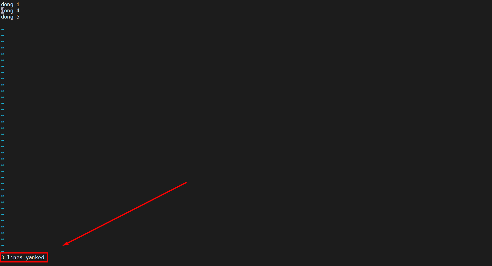

# Menu
[I. Chế độ lệnh và chế độ chèn](#che_do_lenh_va_che_do_chen)

[II. Bắt đầu gõ (a A i I o O)](#bat_dau_go)

[III. Thay thế và xóa một ký tự (r x X)](#thay_the_va_xoa_mot_ky_tu)

[IV. Hoàn tác và lặp lại (u .)](#hoan_tac_va_lap_lai)

[V. Cắt, sao chép và dán một dòng (dd yy p P)](#cat-sao_chep_va_dan_mot_dong)

[VI. Cắt, sao chép và dán các dòng (3dd 2yy)](#cat-sao_chep_va_dan_cac_dong)

[VII. Bắt đầu và kết thúc một dòng (0 hoặc ^ và $)](#bat_dau_va_ket_thuc_mot_dong)

[VIII. Nối hai dòng (J) và hơn thế nữa](#noi_hai_dong)

[IX. Từ (w b)](#tu)

[X. Lưu (hoặc không) và thoát (: w: q: q!)](#luu_va_thoat)

[XI. Bộ đệm văn bản](#bo_dem_van_ban)

[XII. Nhiều tệp](#nhieu_tep)

[XIII. Các từ viết tắt](#cac_tu_viet_tat)

Trình chỉnh sửa `vi` bắt đầu ở chế độ lệnh. Trong chế độ lệnh, bạn có thể nhập lệnh. Một số lệnh sẽ đưa bạn vào chế độ chèn. Trong chế độ chèn, bạn có thể nhập văn bản. Lối thoát phím sẽ đưa bạn trở lại chế độ lệnh.

## I. Chế độ lệnh và chế độ chèn
Trình chỉnh sửa `vi` bắt đầu ở chế độ lệnh. Trong chế độ lệnh, bạn có thể nhập lệnh. Một số lệnh sẽ đưa bạn vào chế độ chèn. Trong chế độ chèn, bạn có thể nhập văn bản. Lối thoát phím sẽ đưa bạn trở lại chế độ lệnh.
**Key: Esc**
**Chức năng: đặt vi (m) trong chế độ lệnh.**

## II. Bắt đầu gõ (a A i I o O)
Sự khác biệt giữa `A` `i` `I` `o` và `O` là vị trí mà bạn có thể bắt đầu nhập. một ý chí thêm vào sau ký tự hiện tại và `A` sẽ thêm vào cuối dòng. tôi sẽ chèn trước ký tự hiện tại và tôi sẽ chèn vào đầu dòng. `o` sẽ đưa bạn vào một cái mới dòng sau dòng hiện tại và `O` sẽ đưa bạn vào một dòng mới trước dòng hiện tại.
- `a`: bắt đầu nhập sau ký tự hiện tại
- `A`: bắt đầu nhập ở cuối dòng hiện tại
- `i`: bắt đầu nhập trước ký tự hiện tại
- `I`: bắt đầu nhập ở đầu dòng hiện tại
- `o`: bắt đầu nhập vào một dòng mới sau dòng hiện tại
- `O`: bắt đầu nhập vào một dòng mới trước dòng hiện tại

## III. Thay thế và xóa một ký tự (r x X)
Khi ở chế độ lệnh (không hại gì khi nhấn phím thoát nhiều lần), bạn có thể sử dụng phím `x` để xóa ký tự hiện tại. Phím `X` lớn (hoặc shift x) sẽ xóa ký tự bên trái của con trỏ. Ngoài ra khi ở chế độ lệnh, bạn có thể sử dụng phím `r` để thay thế một phím tính cách. Phím `r` sẽ đưa bạn vào chế độ chèn chỉ với một lần nhấn phím và sẽ đưa bạn trở lại ngay lập tức sang chế độ lệnh.
- `x`: xóa ký tự bên dưới con trỏ
- `X`: xóa ký tự trước con trỏ
- `r`: thay thế ký tự bên dưới con trỏ
- `p`: dán sau con trỏ (đây là ký tự bị xóa cuối cùng)
- `xp`: chuyển đổi hai ký tự
  

## IV. Hoàn tác và lặp lại (u.)
Khi ở chế độ lệnh, bạn có thể hoàn tác lỗi của mình với `u`. Bạn có thể làm những sai lầm của bạn hai lần với. (nói cách khác,`.` sẽ lặp lại lệnh cuối cùng của bạn).
- `u`: hoàn tác hành động cuối cùng
- `.`: lặp lại hành động cuối cùng

## V. Cắt, sao chép và dán một dòng (dd yy p P)
Khi ở chế độ lệnh, `dd` sẽ cắt dòng hiện tại. `yy` sẽ sao chép dòng hiện tại. Bạn có thể dán dòng được sao chép hoặc cắt cuối cùng sau (`p`) hoặc trước (`P`) dòng hiện tại.
- `dd`: cắt dòng hiện tại
- `yy`: (yank yank) sao chép dòng hiện tại
- `p`: dán sau dòng hiện tại
- `P`: dán trước dòng hiện tại
  
Sau khi dùng lệnh nào đó thì bên dưới sẽ hiển thị thông báo như hình dưới.

## VI. Cắt, sao chép và dán các dòng (3dd 2yy)
Khi ở chế độ lệnh, trước khi nhập dd hoặc `yy`, bạn có thể nhập một số để lặp lại lệnh một số lần. Như vậy, `5dd` sẽ cắt 5 dòng và `4yy` sẽ sao chép (yank) 4 dòng. Điều cuối cùng đó sẽ được ghi bằng vi ở góc dưới bên trái là "4 dòng bị kéo".
- `3dd`: cắt ba dòng
- `4yy`: sao chép bốn dòng

## VII. Bắt đầu và kết thúc một dòng (0 hoặc ^ và $)
Khi ở chế độ lệnh, số `0` và dấu mũ `^` sẽ đưa bạn đến đầu dòng hiện tại, trong khi `$` sẽ đặt con trỏ ở cuối dòng hiện tại. Bạn có thể thêm `0` và `$` vào `d` lệnh, `d0` sẽ xóa mọi ký tự giữa ký tự hiện tại và phần bắt đầu của hàng. Tương tự như vậy, `d$` sẽ xóa mọi thứ từ ký tự hiện tại cho đến cuối dòng. Tương tự `y0` và `y$` sẽ kéo dài cho đến đầu và cuối dòng hiện tại.
- `0`: nhảy đến đầu dòng hiện tại
- `^`: nhảy đến đầu dòng hiện tại
- `$`: nhảy đến cuối dòng hiện tại
- `d0`: xóa cho đến đầu dòng
- `d$`: xóa cho đến cuối dòng

## VIII. Nối hai dòng (J) và hơn thế nữa
Khi ở chế độ lệnh, nhấn `J` sẽ nối dòng tiếp theo vào dòng hiện tại. Với `yyp` bạn nhân đôi một dòng và với `ddp`, bạn chuyển hai dòng.

## IX. Từ (w b)
Khi ở chế độ lệnh, `w` sẽ chuyển sang từ tiếp theo và `b` sẽ chuyển sang từ trước đó. `w` và `b` cũng có thể được kết hợp với `d` và `y` để sao chép và cắt các từ (dw db yw yb).
- `w`: chuyển tiếp một từ
- `b`: lùi lại một từ
- `3w`: chuyển tiếp ba từ
- `dw`: xóa một từ
- `yw`: giật (sao chép) một từ
- `5yb`: giật lại năm từ
- `7dw`: xóa bảy từ

## X. Lưu (hoặc không) và thoát (:w :q :q!)
Nhấn dấu hai chấm : sẽ cho phép bạn đưa ra hướng dẫn về vi (nói về mặt kỹ thuật, đánh máy dấu hai chấm sẽ mở trình soạn thảo cũ). `:w` sẽ ghi (lưu) tệp, `:q` sẽ thoát khỏi tệp không thay đổi tệp mà không lưu và `:q!` sẽ bỏ vi từ bỏ bất kỳ thay đổi nào. `:wq` sẽ lưu và thoát và giống như gõ `ZZ` trong chế độ lệnh.
- `:w`: lưu (ghi)
- `:w fname`: lưu dưới dạng tên
- `:q`: thoát
- `:wq`: lưu và thoát
- `ZZ`: lưu và thoát
- `:q!`: thoát (hủy bỏ các thay đổi của bạn)
- `:w!`: lưu (và ghi vào tệp không thể ghi!)

Cái cuối cùng là một chút đặc biệt. Với `W!` `vi` sẽ cố gắng `chmod` tệp để có quyền ghi (điều này hoạt động khi bạn là chủ sở hữu) và sẽ chỉnh sửa nó trở lại khi ghi thành công. Đây sẽ luôn hoạt động khi bạn root (và hệ thống tệp có thể ghi được).

## XI. Bộ đệm văn bản
Có 36 bộ đệm trong vi để lưu trữ văn bản. Bạn có thể sử dụng chúng với ký tự `"`.
- `"add`: xóa dòng hiện tại và đặt văn bản vào bộ đệm a
- `"g7yy`: sao chép bảy dòng vào bộ đệm g
- `"ap`: dán từ bộ đệm a

## XII. Nhiều tệp
Bạn có thể chỉnh sửa nhiều tệp với `vi`. Đây là một số mẹo
- `vi file1 file2 file3`: bắt đầu chỉnh sửa ba tệp
- `:args`: liệt kê các tệp và đánh dấu tệp đang hoạt động
- `:n`: bắt đầu chỉnh sửa tệp tiếp theo
- `:e`: chuyển đổi với tệp được chỉnh sửa lần cuối
- `:rew`: tua lại con trỏ tệp đến tệp đầu tiên

## XIII. Các từ viết tắt
Với `:ab` bạn có thể đặt các chữ viết tắt trong vi. Sử dụng `:una` để hoàn tác việc viết tắt.
- `:ab str long string`: viết tắt str thành 'chuỗi dài'
- `:una str`: bỏ viết tắt str

