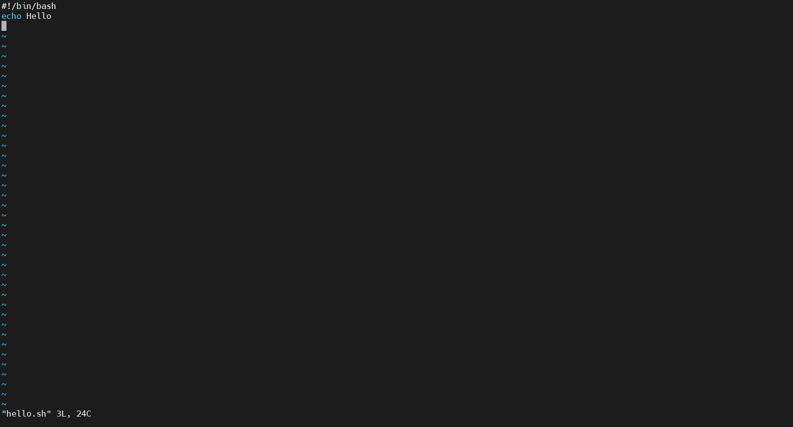

# Menu
[I. Hello world](#hello-world)

[II. she-bang](#she-bang)

[III. Biến](#Bien)

[IV. Nguồn của một script](#nguon_cua_script)

[V. Gỡ rối một tập lệnh](#go_roi_mot_tap_lenh)

[VI. Ngăn chặn giả mạo gốc setuid](#ngan_chan_gia_mao_goc)


<a name="hello-world"></a>

## I. Hello world
Sau khi tạo tập lệnh đơn giản này bằng `vi` hoặc bằng `echo`, bạn sẽ phải `chmod + x hello_world` để làm cho nó có thể thực thi được. Và trừ khi bạn thêm thư mục script vào đường dẫn của mình, bạn sẽ phải gõ đường dẫn đến tập lệnh cho trình bao để có thể tìm thấy nó.
```
[root@centos ~]# echo echo Hello World > hello_world
[root@centos ~]# chmod +x hello_world
[root@centos ~]# ./hello_world
Hello World
[root@centos ~]# ls
```

<a name="she-bang"></a>

## II. she-bang
Hãy mở rộng ví dụ của chúng ta thêm một chút bằng cách đặt `#!/Bin/bash` trên dòng đầu tiên của script.
Các `#!` được gọi là `she-bang` (đôi khi được gọi là sha-bang), trong đó she-bang là kiểu đầu tiên hai nhân vật của kịch bản.

Tạo một scrip Hello World
- Tạo file có tên `hello.sh`: `touch hello.sh`
- Thêm quyền thực thi đối với file: `chmod +x hello.sh`
- Dùng trình soạn thảo `vi` truy cập vào file `hello.sh` và thêm code:
```
#!/bin/bash
echo "Hello World"
```

```
[root@centos ~]# touch hello.sh
[root@centos ~]# chmod +x hello.sh
[root@centos ~]# ls
anaconda-ks.cfg  atxt.txt  hello.sh  hello_world  laiduy  so.txt  Ten.txt  test.txt  tuoi
[root@centos ~]# vi hello.sh
```


<a name="bien"></a>

## III. Biến
Đây là một ví dụ đơn giản về một biến bên trong một tập lệnh. 
Tạo 1 file có tên là `varl` như cách ở trên. Sau khi tạo xong, ta thêm nội dung cho file:
```
#!/bin/bash
#
# simple variable in script
#
var1=4
echo var1 = $var1
```

Tập lệnh có thể chứa các biến nhưng vì các tập lệnh được chạy trong trình bao của chính chúng nên các biến không tồn tại ở cuối bài.
```
[root@centos ~]# echo $varl
[root@centos ~]#
[root@centos ~]# ./varl
var1 = 4
[root@centos ~]#
```

<a name="nguon_cua_script"></a>

## IV. Nguồn của một script
May mắn thay, bạn có thể buộc một tập lệnh chạy trong cùng một trình bao. Điều này được gọi là tìm nguồn cung ứng một tập lệnh.
```
[root@centos ~]# source ./varl
var1 = 4
```

Bên trên giống với bên dưới.
```
[root@centos ~]# . ./varl
varl = 4
```

<a name="go_roi_mot_tap_lenh"></a>

## V. Gỡ rối một tập lệnh
Một cách khác để chạy một tập lệnh trong một trình bao riêng biệt là nhập bash với tên của tập lệnh như một tham số.
```
[root@centos ~]# bash filetest
3k
[root@centos ~]#
```

Mở rộng điều này thành `bash -x` cho phép bạn xem các lệnh mà trình bao đang thực thi.
```
[root@centos ~]# bash -x filetest
+ tien=3k
+ echo 3k
3k
[root@centos ~]# cat filetest
tien=3k
echo 3k
[root@centos ~]#
```

<a name="ngan_chan_gia_mao_goc"></a>

## VI. Ngăn chặn giả mạo gốc setuid
Một số người dùng có thể cố thực hiện giả mạo gốc tập lệnh dựa trên setuid. Đây là một điều hiếm nhưng có thể tấn công. Để cải thiện bảo mật tập lệnh và tránh giả mạo thông dịch viên bạn cần thêm `-` sau `#!/bin/bash`, vô hiệu hoá và xử lý tuỳ chọn khác, do đó trình bao sẽ không chấp nhận bất kỳ tuỳ chọn.
```
#!/bin/bash -
Hoặc
#!/bin/bash --
```
Bất kỳ đối số nào sau dấu `-` được coi là tên tệp và đối số. Một đối số của `-` là tương đương với `--`.


