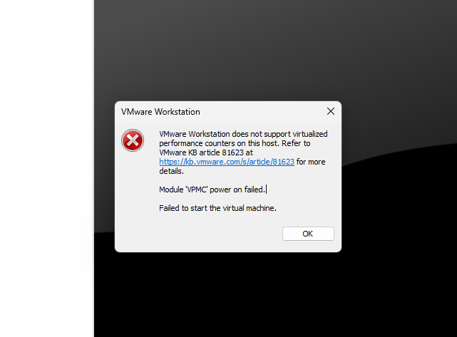
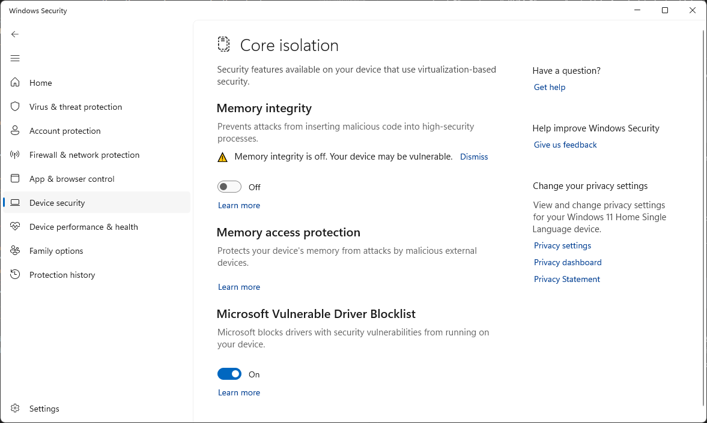
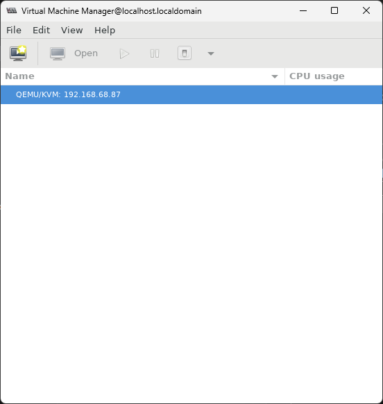

>KVM
# Chapter 2: KVM Installation
# 1. What is KVM?
- **KVM (kernel-base Virtual Machine)** là công nghệ ảo hóa nguồn mở cho phép bạn tạo và quản lý nhiều máy ảo (VM) trên hệ thống dựa trên Linux. Nó cho phép bạn chạy đồng thời nhiều hệ điều hành khách, chẳng hạn như Linux, Windows, macOS và các hệ điều hành khác trên một máy chủ vật lý. KVM là một phần của nhân Linux, giúp nó có hiệu quả cao và được tích hợp chặt chẽ với hệ điều hành.

- KVM hoạt động như một **type 1 hypervisor**, còn được gọi là trình ảo hóa "bare-metal". Trình ảo hóa là một lớp phần mềm nằm trực tiếp trên phần cứng và cho phép quản lý nhiều máy ảo. Trong trường hợp của KVM, nó tận dụng nhân Linux để hoạt động như một trình ảo hóa.

- KVM tận dụng các tiện ích mở rộng ảo hóa phần cứng có trong các CPU hiện đại, chẳng hạn như **Intel VT-x và AMD-V**. Các tiện ích mở rộng này cho phép trình ảo hóa tạo và quản lý máy ảo một cách hiệu quả. KVM sử dụng cơ sở hạ tầng ảo hóa của nhân Linux (KVM module) để tương tác với các tính năng ảo hóa CPU này.

- Trong khi KVM xử lý ảo hóa CPU, nó yêu cầu một thành phần không gian người dùng bổ sung để mô phỏng các thiết bị phần cứng khác, chẳng hạn như đĩa, giao diện mạng và đồ họa. Thành phần không gian người dùng này thường được cung cấp bởi **QEMU (Trình mô phỏng nhanh - Quick Emulator)**. QEMU hoạt động cùng với KVM để cung cấp các khả năng ảo hóa hoàn chỉnh và chúng cùng nhau tạo thành một giải pháp ảo hóa mạnh mẽ.
# Một số lưu ý khi cài đặt
- Để cài đặt KVM, CPU của máy cần phải hỗ trợ ảo hoá phần cứng Intel VT-x hoặc AMD-V, để xác định CPU có những tính này không, hay chạy câu lệnh trên tại máy Linux
```bash
$ egrep -c "svm|vmx" /proc/cpuinfo
2
```
Nếu giá trị trả về là 0 chứng tỏ rằng CPU không hỗ trợ ảo hoá phần cứng, cần khích hoạt chức năng này ở VMware:


- Nếu gặp lỗi dưới đây, bạn có thể phải kích hoạt chức năng hỗ trợ ảo hoá phần cứng trong BIOS của máy. Nếu vẫn tiếp tục gặp lỗi hãy kiểm tra các bước dưới đây


- Cài đặt KVM trên máy ảo sử dụng VMware được cài trên Window, vì thế trước hết cần tắt một số tính năng của Windows:
    - Hyper-V: chạy cmd dưới quyền admin và chạy lệnh sau
    ```cmd
    > bcdedit /set hypervisorlaunchtype off
    ```
    sau đo restart lại máy và kiểm tra lại
    - Nếu bạn sử dụng Windows 11, hãy tắt tính năng memmory integrity theo các bước dưới đây
        - Truy cập **Settings** -> **Pravicy & Security** -> **Windows Security**
        - Tại cửa sổ Windows Sercurity hãy chọn **Device Security**, tại phần **Core isolation** chọn **Core isolation details**
        - Tắt tính năng **Memory integrity** 
        
# 2. Install KVM on CentOS 7
- Cài đặt các gói cần thiết:
```bash
sudo yum -y install qemu-kvm libvirt bridge-utils virt-manager
```
Trong đó 
- Kiểm tra các gói đã cài bằng lệnh:
```bash
$ lsmod | grep kvm
kvm_intel             188793  0
kvm                   653928  1 kvm_intel
irqbypass              13503  1 kvm
```
- Chạy dịch vụ KVM và cho phép chạy cùng hệ thống:
```bash
sudo systemctl start libvirtd
sudo systemctl enable libvirtd
```
- Cài công cụ đồ hoạ virt-manager:
```bash
sudo yum install -y "@X Window System" xorg-x11-xauth xorg-x11-fonts-* xorg-x11-utils
```
- Kiểm tra công cụ đồ hoạ đã được cài đặt:
```bash
virt-manager
```
- Lưu ý nếu bạn gặp lỗi không thể kết nối đến server, hãy cài đặt openssh-askpass:
```bash
sudo yum install -y openssh-askpass
```

# 3. Install KVM on Ubuntu
- Cài đặt các gói cần thiết
```bash
sudo apt-get install qemu-kvm libvirt-daemon-system libvirt-clients bridge-utils
```
- Kiểm tra các gói được cài đặt:
```bash
$ lsmod | grep kvm
kvm_intel             438272  0
kvm                  1138688  1 kvm_intel
```
- Cài đặt công cụ đồ hoạ virt-manager (kiểm tra lại bằng cách truy cập giống bên trên):
```bash
sudo apt-get install virt-manager
```