>KVM
# Chapter 1: Introduction
# 1. Bare metal, Virtual Machines, Containers Concepts
## 1.1. Bare metal
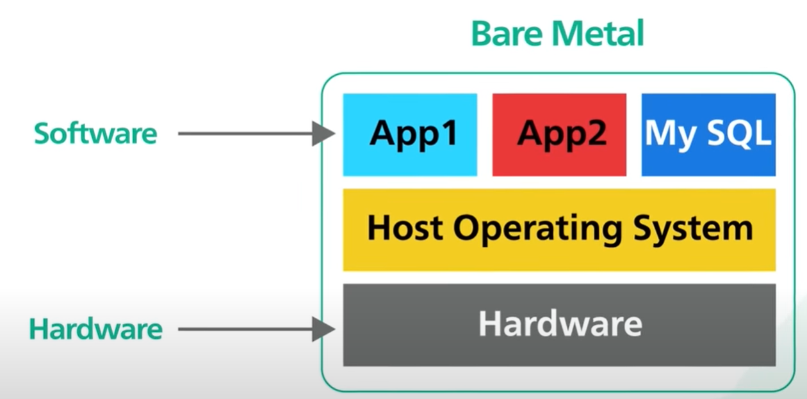
- Bare metal đề cập đến một máy tính hoặc máy chủ vật lý mà không có bất kỳ lớp phần mềm bổ sung hoặc ảo hóa nào. 
- Là nền tảng cơ bản của điện toán, nơi hệ điều hành chạy trực tiếp trên phần cứng.
- HĐH có toàn quyền kiểm soát tài nguyên của hệ thống, chẳng hạn như CPU, bộ nhớ, lưu trữ và kết nối mạng.
- Thường được sử dụng trong điện toán hiệu suất cao, ứng dụng chuyên biệt và các tình huống mà truy cập phần cứng trực tiếp là rất quan trọng đối với hiệu suất.
- Tuy nhiên, tính linh hoạt hạn chế do nhiều phiên bản HĐH không thể chạy đồng thời trên cùng một phần cứng. Đồng thời, khó quản lý và bảo trì, đặc biệt khi triển khai nhiều ứng dụng.
## 1.2. Virtual Machines
- Máy ảo là phần mềm giả lập của hệ thống máy tính, cho phép tạo nhiều phiên bản biệt lập của một hệ điều hành chạy trên một trình ảo hóa(hypervisor), chịu trách nhiệm quản lý ảo hóa và chia sẻ tài nguyên phần cứng.
- Mỗi VM hoạt động độc lập, như thể nó là một máy vật lý riêng biệt, với hệ điều hành, ứng dụng và cấu hình riêng. 
- Trình ảo hóa tóm tắt phần cứng cơ bản, cho phép nhiều máy ảo cùng tồn tại trên một máy chủ vật lý.

- Ưu điểm:
    - Cách ly: Mỗi VM hoạt động độc lập, cung cấp khả năng cách ly mạnh mẽ giữa các ứng dụng.
    - Tính linh hoạt: Các máy ảo khác nhau có thể chạy các hệ điều hành khác nhau, giúp dễ dàng đáp ứng các yêu cầu phần mềm khác nhau.
    - Snapshot and migrate: Máy ảo có thể dễ dàng được sao chép, snapshot và di chuyển giữa các máy chủ vật lý khác nhau.
- Nhược điểm:
    - Máy ảo bao gồm một lớp bổ sung (pervisor), có thể tăng thêm một số chi phí hoạt động.
    - Tài nguyên không hiệu quả: Mỗi VM yêu cầu hệ điều hành khách riêng, điều này có thể dẫn đến mức tiêu thụ tài nguyên cao hơn.
## 1.3. Containers
- Container là gói phần mềm nhẹ và di động bao gồm mã ứng dụng, thời gian chạy, thư viện và các thành phần phụ thuộc cần thiết để chạy ứng dụng.
- Các container dựa trên các công nghệ container hóa như Docker hoặc Kubernetes. 
- Không giống như máy ảo, các bộ chứa chia sẻ nhân của Hệ điều hành máy chủ, có nghĩa là chúng nhẹ hơn và hiệu quả hơn. 

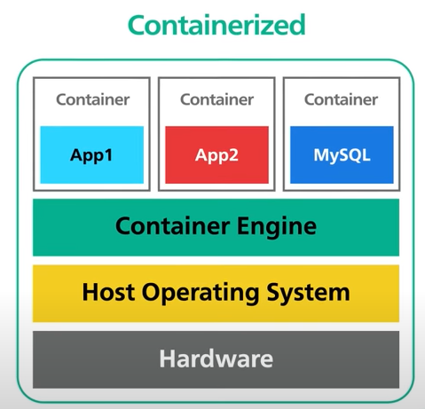
- Ưu điểm:
    - Hiệu quả: Các bộ chứa có chi phí hoạt động thấp hơn vì chúng chia sẻ nhân hệ điều hành máy chủ và tránh chạy một hệ điều hành khách đầy đủ.
    - Tính di động: Các bộ chứa có tính di động cao, giúp dễ dàng chạy cùng một ứng dụng một cách nhất quán trên các môi trường khác nhau.
    - Khả năng mở rộng: Các vùng chứa có thể được triển khai và mở rộng nhanh chóng, khiến chúng trở nên lý tưởng cho các kiến ​​trúc vi dịch vụ hiện đại.
- Nhược điểm:
    - Cách ly hạn chế: Mặc dù các bộ chứa cung cấp khả năng cách ly ở cấp không gian người dùng, nhưng chúng không bị cô lập như VM.
    - Mối quan tâm về bảo mật: Trong một số trường hợp, tài nguyên hạt nhân được chia sẻ có thể bị khai thác nếu các biện pháp bảo mật không được triển khai đúng cách.
- Giải pháp: sử dụng Container trên Virtual machine

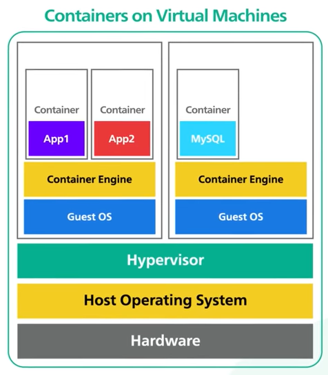
# 2. Virtualization
- Ảo hóa được hiểu một cách đơn giản là chạy nhiều máy chủ ảo trên hạ tầng một máy chủ vật lý. Trên mỗi máy ảo có hệ điều hành riêng giống như một máy chủ thật và được triển khai các môi trường, ứng dụng khác nhau để phù hợp với hoạt động và mục đích của doanh nghiệp.
- Máy ảo: (Virtual machine hay Guest)là phiên bản ảo hóa của hệ điều hành và ứng dụng. Mỗi VM là một thùng chứa biệt lập hoạt động độc lập với các VM khác trên cùng một máy chủ. Trình ảo hóa phân bổ các tài nguyên như CPU, bộ nhớ, dung lượng ổ đĩa và băng thông mạng cho từng máy ảo.

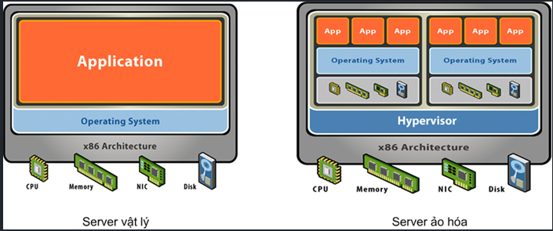
- Mục đích:
    - Cách ly: Với công nghệ ảo hóa, chúng ta có thể chạy nhiều máy ảo trên một máy thật với nhiều hệ điều hành khác nhau, nhờ thế mà ta cũng có thể tách từng dịch vụ ra để cài trên từng máy ảo.

    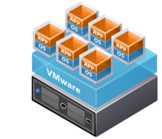
    - Cô lập: Khi mỗi dịch vụ quan trọng được cài trên một máy ảo khác nhau thì nếu có sự cố, các dịch vụ khác cũng không bị ảnh hưởng gì. Thêm vào đó, nó cũng giúp người dùng quản lí tốt hơn tài nguyên trên các máy ảo.

    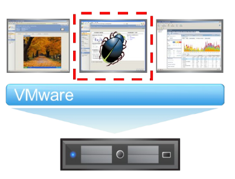
    - Đóng gói: Với công nghệ ảo hóa, các máy ảo được đóng gói thành các file riêng biệt, nhờ vậy mà nó có thể dễ dàng được sao chép để backup và di chuyển sang các hệ thống khác để chạy.

    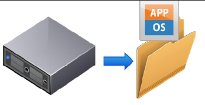
- Có hai công nghệ ảo hoá là:
    - Dedicated virtualization (Bare-Metal Hypervisor): Hypervisor tương tác trực tiếp với phần cứng của máy chủ để quản lý, phân phối và cấp phát tài nguyên. Loại ảo hóa này bao gồm các giải pháp như Vmware ESXi, Microsoft Hyper-V, Xen Server, KVM.
    - Hosted Architecture: Đây là loại ảo hóa Hypervisor giao tiếp với phần cứng thông qua hệ điều hành. Hypervisor lúc này được xem như một ứng dụng của hệ điều hành và các phương thức quản lý, cấp phát tài nguyên đều phải thông qua hệ điều hành. Loại ảo hóa này bao gồm các giải pháp như Vmware WorkStation, Oracle VirtualBox, Microsoft Virtual PC, …

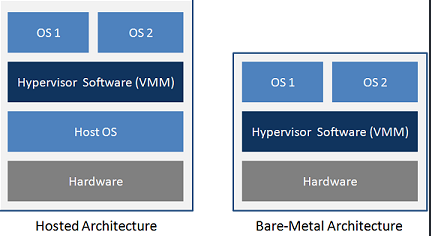
# 3. Ring
Trong kiến trúc x86 một cơ chế để cách ly ứng dụng người dùng với hệ điều hành để tạo một môi trường hoạt động an toàn bằng cách sử dụng khái niệm cấp đặc quyền (privileged levels)

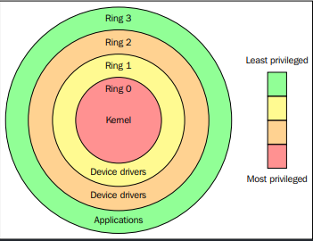
- Ring 0 (Kernel Mode): Còn được gọi là mức đặc quyền cao nhất, chế độ này được dành riêng cho nhân hệ điều hành. Nó có quyền truy cập không hạn chế vào tất cả các tài nguyên phần cứng và có thể thực thi bất kỳ lệnh nào có sẵn trên CPU. Trình điều khiển thiết bị và các dịch vụ hệ thống quan trọng chạy ở chế độ này.
- Ring 1 và Ring 2: Trước đây, các vòng này dành cho các mức đặc quyền trung gian giữa chế độ người dùng và chế độ nhân. Tuy nhiên, chúng không được sử dụng phổ biến trên các hệ điều hành hiện đại và hầu hết các hệ điều hành x86 chỉ sử dụng Ring 0 (kernel mode) và Ring 3 (user mode).
- Ring 3 (Chế độ người dùng): Đây là mức đặc quyền thấp nhất và được sử dụng để thực thi các ứng dụng của người dùng. Trong chế độ này, quyền truy cập trực tiếp vào tài nguyên phần cứng và hướng dẫn đặc quyền bị hạn chế, ngăn các ứng dụng người dùng can thiệp vào sự ổn định và bảo mật của hệ thống.
# 4. Type of Virtualization
## 4.1. Ảo hoá hoàn toàn (Full Virtualization)
Trong ảo hóa hoàn toàn, các máy ảo (VM) được cách ly hoàn toàn với phần cứng bên dưới và chúng không biết rằng chúng đang chạy trong môi trường ảo hóa. Trình ảo hóa trình bày một đại diện ảo của phần cứng, mà các máy ảo tương tác như thể chúng đang chạy trực tiếp trên các máy vật lý.

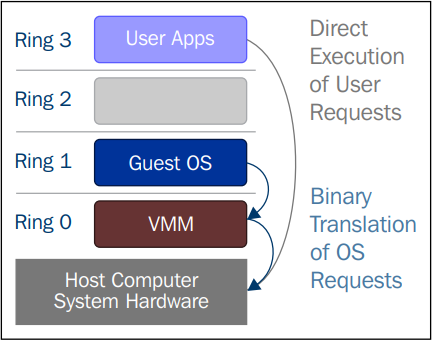

Ví dụ: VMware vSphere/ESXi, Microsoft Hyper-V (khi sử dụng phần mở rộng ảo hóa Intel VT hoặc AMD-V).

## 4.2. Ảo hoá song song (Para-virtualization)
Ảo hóa song song yêu cầu một số sửa đổi đối với hệ điều hành khách để chạy trên môi trường ảo hóa. Máy ảo tương tác với giao diện "hypervisor-aware" đặc biệt để truy cập tài nguyên phần cứng và thực hiện các hoạt động đặc quyền hiệu quả hơn so với ảo hóa hoàn toàn.

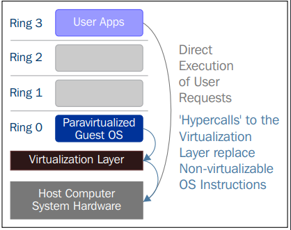

Ví dụ: Xen và các phiên bản cũ hơn của Microsoft Hyper-V (khi sử dụng trình điều khiển ảo hóa song song).
## 4.3. Ảo hoá hỗ trợ phần cứng (Hardware-assisted Virtualization hoặc Hybrid Virtualization)
Ảo hóa có sự hỗ trợ của phần cứng sử dụng kết hợp hỗ trợ phần cứng (phần mở rộng Intel VT hoặc AMD-V) và ảo hóa phần mềm để nâng cao hiệu suất và khả năng của ảo hóa.

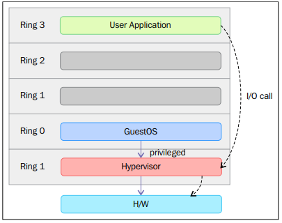

Ví dụ: KVM (Kernel-base Virtual Machine), VMware Workstation và các phiên bản mới hơn của Microsoft Hyper-V.
# 5. Hypervisor
Hypervisor, hay Virtual Machine Monitor (VMM)là một thành phần phần mềm hoặc chương trình cơ sở cho phép ảo hóa bằng cách tạo và quản lý các máy ảo (VM) trên một máy vật lý (máy chủ). Nó tóm tắt các tài nguyên phần cứng cơ bản và cho phép nhiều máy ảo chạy độc lập và đồng thời trên cùng một máy chủ vật lý.

Có hai loại trình ảo hóa chính:
- Type I Hypervisor (Bare-Metal): Loại trình ảo hóa này chạy trực tiếp trên phần cứng vật lý mà không cần hệ điều hành bên dưới. Nó có quyền truy cập trực tiếp vào tài nguyên phần cứng của máy chủ, giúp nó hoạt động hiệu quả và nhẹ hơn. Ví dụ về các trình ảo hóa loại 1 bao gồm:
    - VMware vSphere/ESXi
    - Microsoft Hyper-V (trong một số cấu hình)
    - KVM (Kernel-base Virtual Machine)
    - Xen

Type I Hypervisor thường được sử dụng trong các trung tâm dữ liệu và môi trường doanh nghiệp để cung cấp ảo hóa máy chủ.

- Type II Hypervisor (Hosted): Loại trình ảo hóa này chạy trên hệ điều hành hiện có, giống như bất kỳ ứng dụng nào khác. Nó dựa vào hệ điều hành máy chủ để quản lý quyền truy cập vào tài nguyên phần cứng. Mặc dù các trình ảo hóa loại 2 thường kém hiệu quả hơn các trình ảo hóa loại 1, nhưng chúng thân thiện với người dùng hơn và phù hợp với các tình huống ảo hóa máy tính để bàn hoặc máy trạm. Ví dụ về các trình ảo hóa loại 2 bao gồm:

    - VMware Workstation
    - Oracle VirtualBox
    - Microsoft Hyper-V (trong một số cấu hình nhất định)
    - Parallels Desktop (dành cho macOS)

Type 2 Hypervisor thường được sử dụng để thử nghiệm, phát triển và chạy nhiều hệ điều hành trên một máy tính.