>KVM
# Chapter 4: Làm việc với VM trong KVM
# 1. Truy cập VM bằng console
- Trước hết hãy khởi động dịch vụ trên máy VM
```bash
systemctl start serial-getty@ttyS0.service
systemctl enable serial-getty@ttyS0.service
```
- Sau đó đăng nhập bằng Console qua lệnh `virsh console [VM_name]`, ví dụ:
```bash
$ virsh console newVM
Connected to domain newVM
Escape character is ^]

CentOS Linux 7 (Core)
Kernel 3.10.0-1160.el7.x86_64 on an x86_64

localhost login: root
Password:
Last login: Thu Jul 27 04:23:10 on tty1
[root@localhost ~]#

```
Lưu ý: đăng nhập vào máy VM sử dụng tài khoản và mật khẩu của máy VM, để đăng xuất khỏi phiên, sử dụng tổ hợp `Ctrl` + `]`
# 2. Thao tác với máy ảo 
## 2.1. Sửa thông tin của VM
- Ta có thể sửa đổi các thông tin của VM như tên, số lượng CPU ảo, lượng RAM, hệ điều hành.v..v..
- Nhập lệnh `virsh edit [VM_name]`, ta sẽ được chuyển hướng đến một file XML, ta có thể chỉnh sửa một số thông tin đặc trưng ở một số trường sau:
    - Tên của máy ảo tại thẻ:
    ```xml
    <name>centos7.0</name>
    ```
    - Số lượng CPU của máy ảo:
    ```xml
    <vcpu placement='static'>1</vcpu>
    ```
    - Dung lượng RAM của máy ảo (Đơn vị tính được định nghĩa bởi thuộc tính `unit`)
    ```xml
    <memory unit='KiB'>524288</memory>
    ```
    - Thông số của disk
    ```xml
    <disk type='file' device='disk'>
      <driver name='qemu' type='qcow2'/>
      <source file='/var/lib/libvirt/images/centos7.0.qcow2'/>
      <target dev='vda' bus='virtio'/>
      <address type='pci' domain='0x0000' bus='0x00' slot='0x07' function='0x0'/>
    </disk>
    ```
## 2.2. Clone
Để clone một máy ảo ta cần làm theo các bước sau:
- Xác định máy ảo cần clone:
```bash
$ virsh list --all
 Id    Name                           State
----------------------------------------------------
 3     newVM                          running
```
- Tạm dừng máy ảo:
```bash
$ virsh suspend newVM
Domain newVM suspended
```
- Tự động sao chép với `--auto-clone`: tuỳ chọn này sẽ sao chép tất cả các disk của VM.
```bash
$ virt-clone --original=newVM --name=newVM.clone --auto-clone
WARNING  Setting the graphics device port to autoport, in order to avoid conflicting.
Allocating 'newVM.clone.qcow2'                                                       | 5.0 GB  00:00:05

Clone 'newVM.clone' created successfully.
```
- Sao chép thủ công disk với `--file`, giúp người dùng có thể chỉ định những disk nào được sao chép:
  - kiểm tra số lượng và vị trí disk mà máy ảo sử dụng
  ```bash
  $ virsh dumpxml newVM | grep "source file"
      <source file='/var/lib/libvirt/images/newVM.qcow2'/>
      <source file='/var/lib/libvirt/images/otherdisk.qcow2'/>
  ```
  - Clone có chọn disk thủ công bằng lệnh:
  ```bash
  virt-clone --original=newVM --name=newVM.clone --file /var/lib/libvirt/images/newVM.qcow2
  ```
- Tiếp tục chạy máy ảo ban đầu và khởi chạy máy ảo đã sao chép
```bash
$ virsh list --all
 Id    Name                           State
----------------------------------------------------
 3     newVM                          paused
 -     newVM.clone                    shut off

$ virsh resume newVM
Domain newVM resumed

$ virsh start newVM.clone
Domain newVM.clone started

$ virsh list --all
 Id    Name                           State
----------------------------------------------------
 3     newVM                          running
 4     newVM.clone                    running

```
## 2.3. Snapshot
Snapshot là trạng thái của hệ thống tại một thời điểm nhất định, nó sẽ lưu lại cả những cài đặt và dữ liệu. Với snapshot, Bạn có thể quay trở lại trạng thái của máy ảo ở một thời điểm nào đó dễ dàng.
- Tạo snapshot
```bash
$ virsh snapshot-create-as --domain newVM --name Installed --description "Finished the installation"
Domain snapshot Installed created
```
- Xem danh sách Snapshot
```bash
$  virsh snapshot-list newVM
 Name                 Creation Time             State
------------------------------------------------------------
 Installed            2023-07-27 16:41:30 +0700 running
```
- Xem thông tin chi tiết của một snapshot
```bash
virsh snapshot-info --domain newVM --snapshotname Installed
Name:           Installed
Domain:         newVM
Current:        yes
State:          running
Location:       internal
Parent:         -
Children:       0
Descendants:    0
Metadata:       yes
```
- Quay lại snapshot cũ
```bash
$ virsh snapshot-revert newVM Installed
```
- Xoá snapshot
```bash
$ virsh snapshot-delete newVM Installed
Domain snapshot Installed deleted
```
# 3. Quản lí máy ảo với công cụ Virtual Machine Manager
Để truy cập công cụ Virtual Machine Manager ta sử dụng lệnh `virt-manager`
## 3.1. Tạo máy ảo với virt-manager
- Chọn **File** -> **New Virtual Machine**

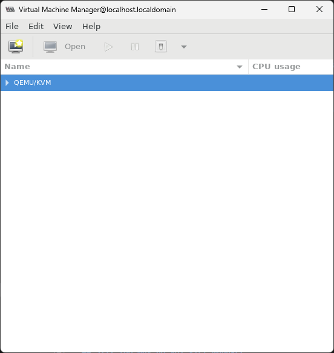
- Ở đây ta chọn cài bằng file ISO nên sẽ tích vào ô **Local install media (ISO image or CDROM)** và chọn **Forward**

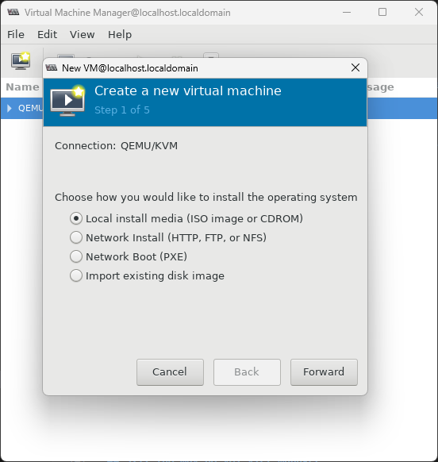
- Chọn **Browse..** và chọn file ISO cần cài, sau đó chọn OS type và Version:

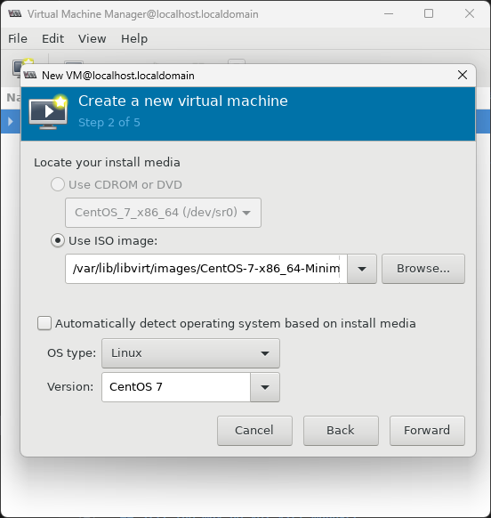
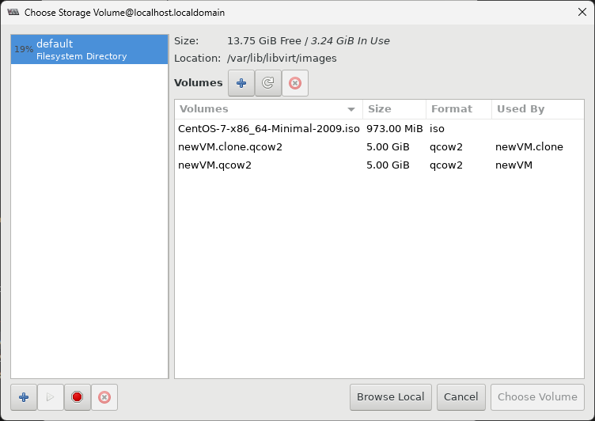
- Cài dung lượng RAM và số vCPU cho máy ảo:

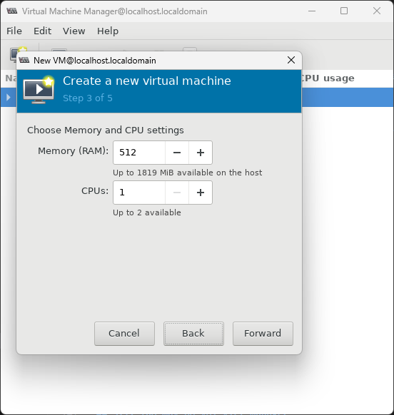
- Tạo một ổ đĩa mới cho máy ảo hoặc thêm ổ đĩa sẵn có:

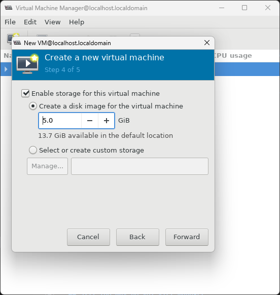
- Kiểm tra lại các thông số của máy ảo và đặt tên cho máy ảo:

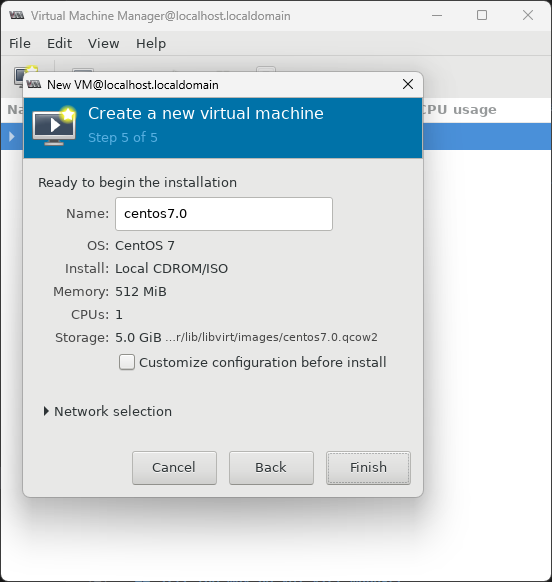
- Sau khi tạo máy ảo thành công, sẽ có một cửa sổ hiện ra để thực hiện cài máy ảo:

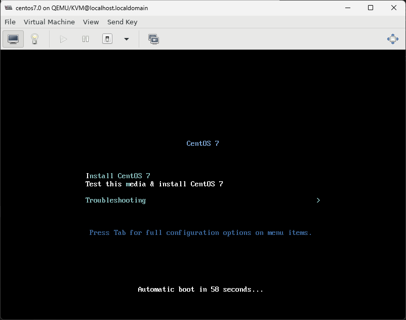
- Tiến hành cài máy ảo như bình thường.
## 3.2. Các thao tác với máy ảo
- Truy cập máy ảo: Nhấn đúp vào máy ảo để hiện ra màn hình của máy ảo đó

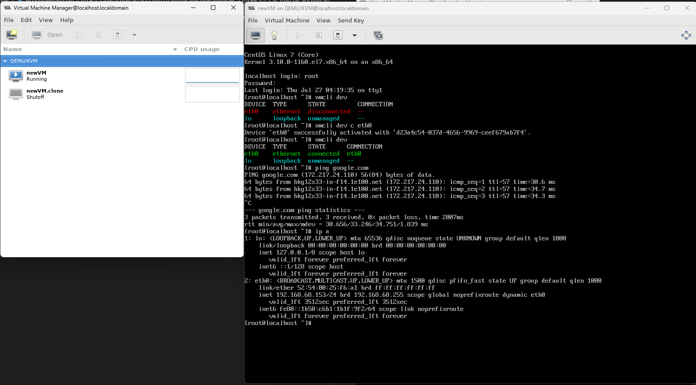
- Các thao tác bật/tắt, ... với máy ảo: Chọn chuột phải vào máy ảo và thực hiện các thao tác Bật/Tắt, Tạm dừng/Tiếp tục, Xoá, Kết nối với máy ảo


## 3.3. Làm việc với máy ảo
- Xem, sửa thông tin của máy ảo: Truy cập vào máy ảo và chọn vào biểu tượng hình bóng đèn , ta có thể xem các thông tin về các thành phần đang chạy của máy ảo, đồng thởi sửa đổi các thông tin như Tên, vCPU, RAM, Disk, Network và các thiết bị truy cập

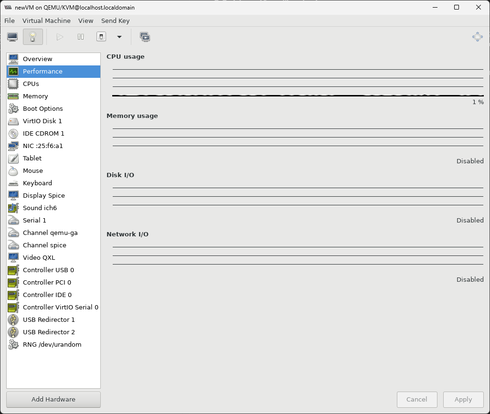

- Clone: Chọn chuột phải vào máy ảo cần clone và chọn **Clone...** (Máy ảo cần phải được tạm dừng hoặc tắt), sau đó điền tên máy ảo sẽ được sao chép và chọn ổ đĩa được sao chép

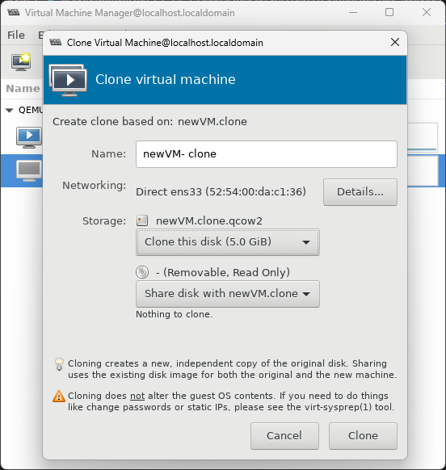

- Snapshot: Kết nối với máy ảo và chọn biểu tượng  để xem các bản snapshot của máy ảo:
  - Chọn biểu tượng  để tạo một snapshot
  
  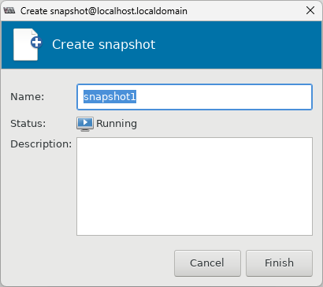
  - Chọn một snapshot và chọn biểu tượng  để quay lại snapshot đã tạo
  - Chọn snapshot và chọn biểu tượng  để xoá snapshot đã có

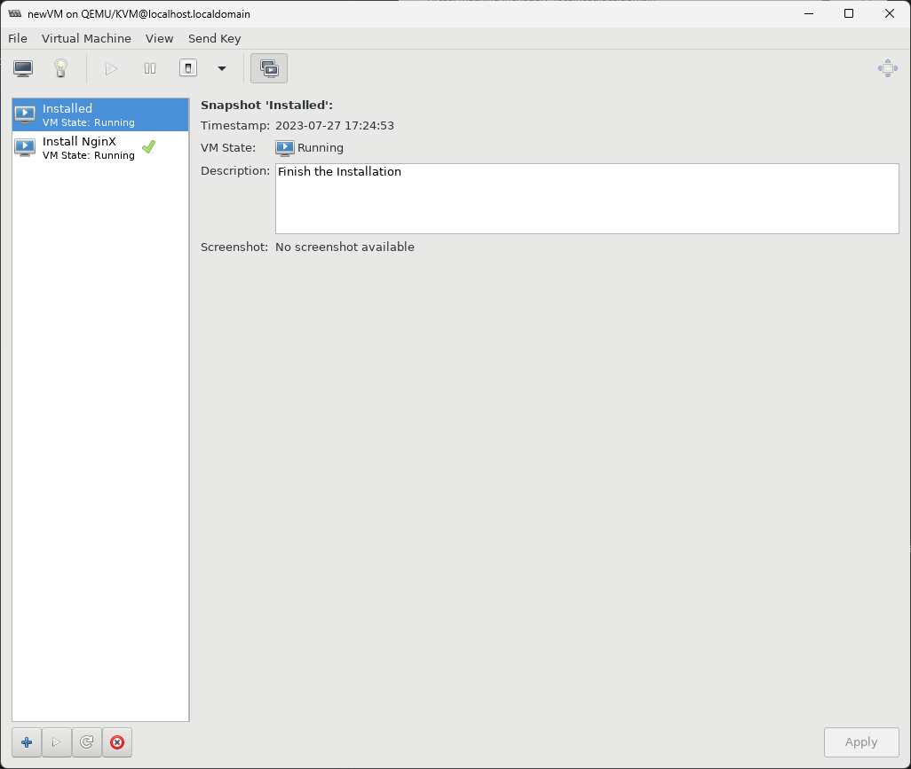

