# Các bước đẩy code lên github : 

- Yêu cầu  tải [githubdestop](https://desktop.github.com/)

- Đăng nhập vào github Desktop 

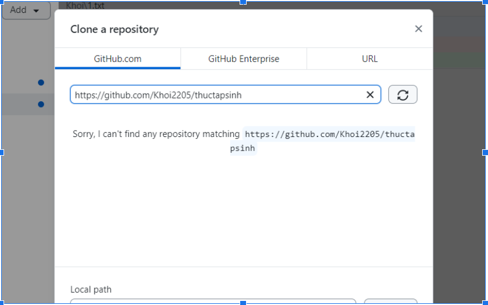
- Add tên repository mình vào : 
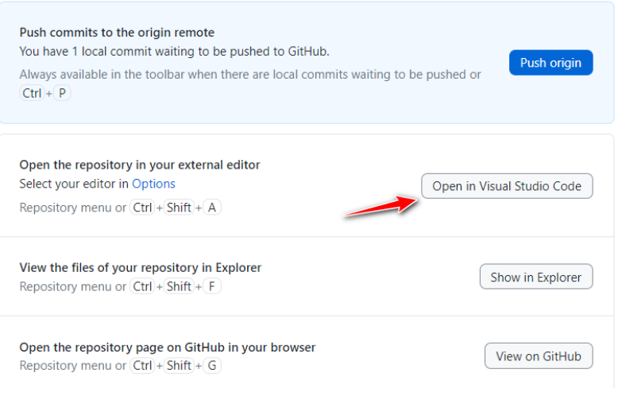

- Nhập nội dung để mình push lên github 

VD 

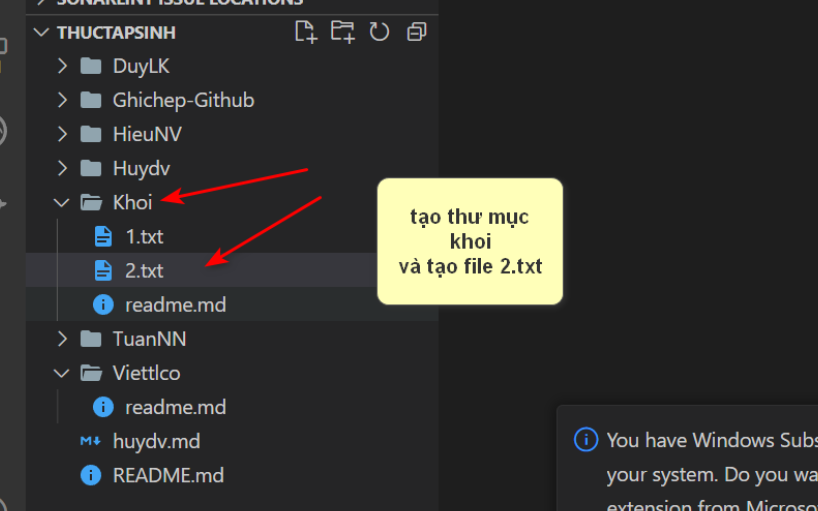

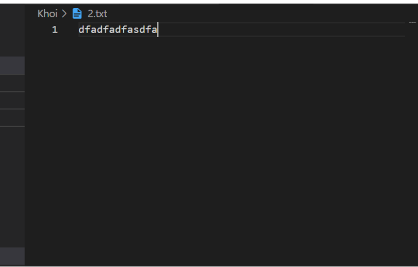
- Rồi quay lại git desktop để push lên github : 
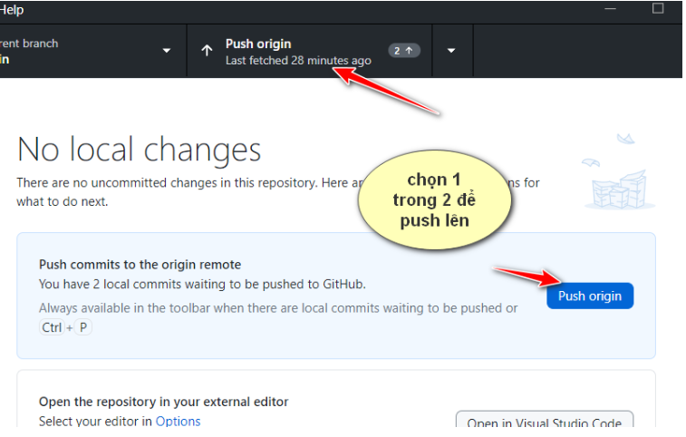
Sau khi push lên mình vào pull requests
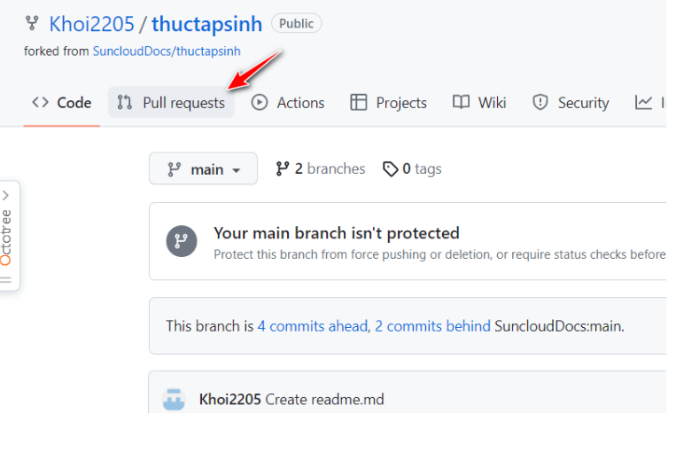

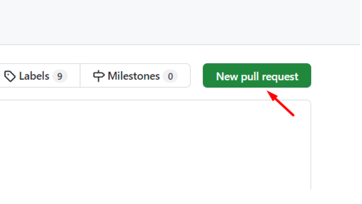
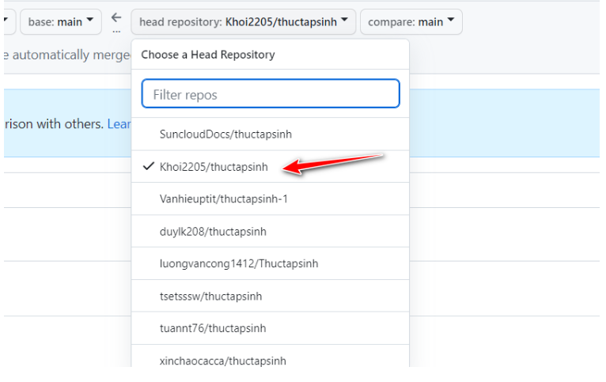

- Chọn pull lên repository của chính mình vừa tạo 

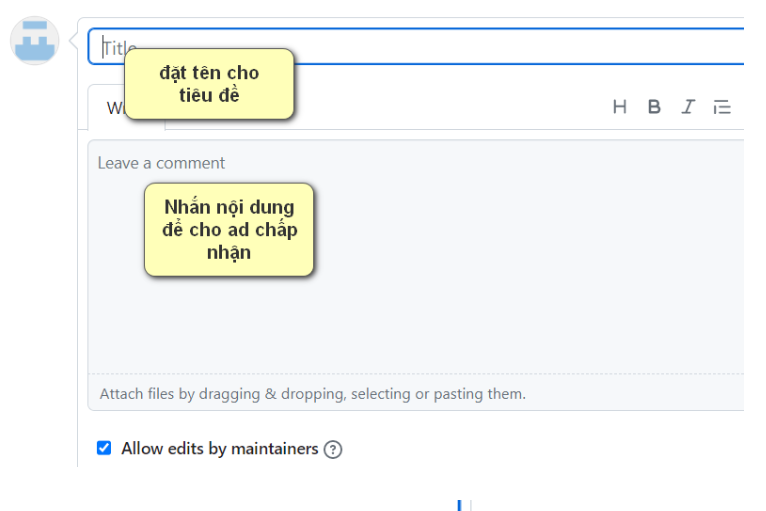
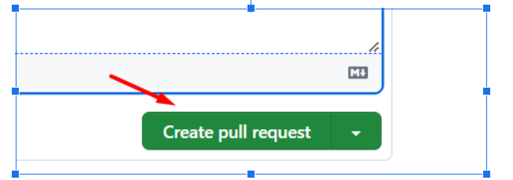

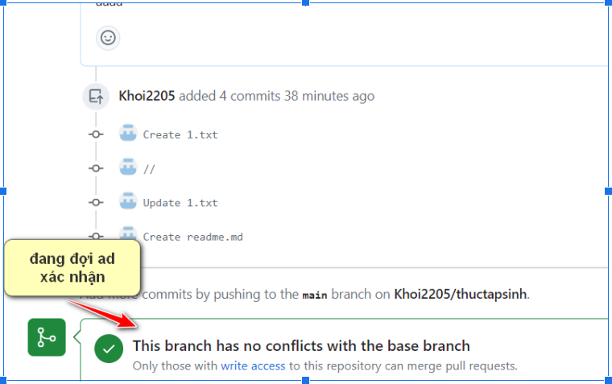
- Tại phía admin repo xác nhận để code được xác nhận vào luồng brand:

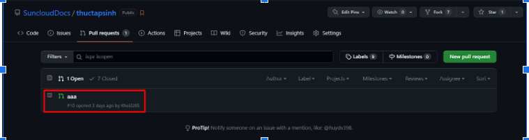
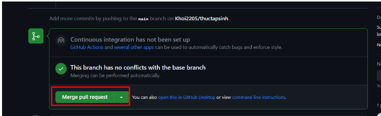

- Click Confirm để hoàn thành

- Check lại repo chính xem đã lên code chưa:s